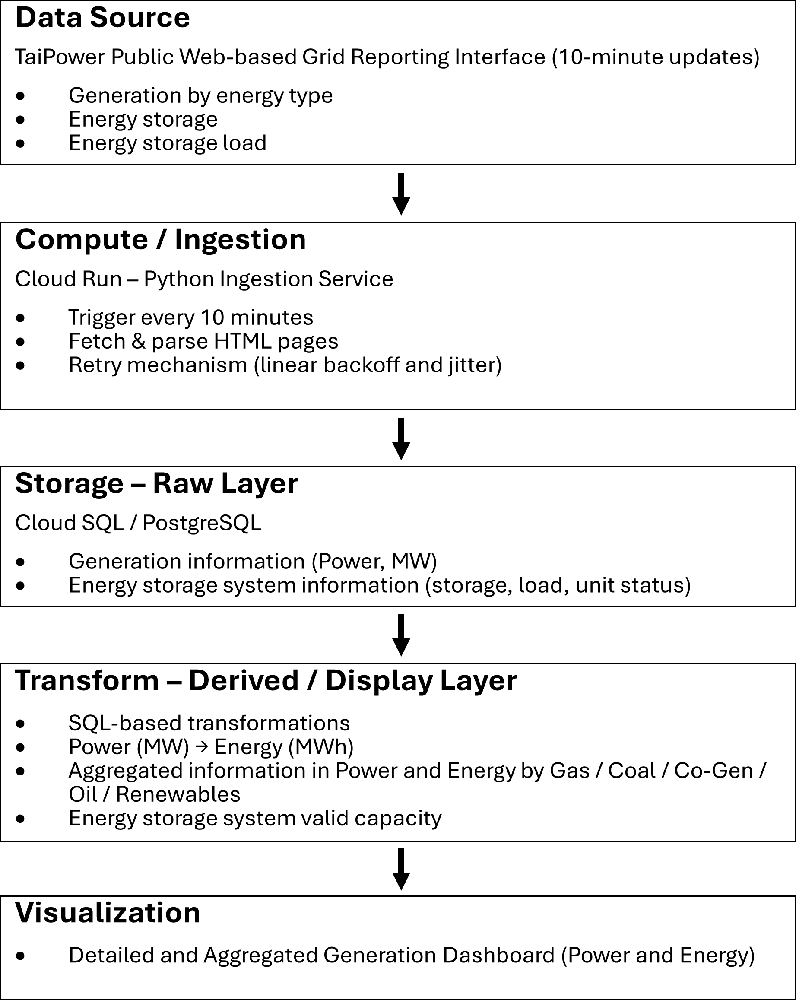

# Taiwan Energy Grid Platform

Cloud-native energy data platform that ingests Taiwan power system data every 10 minutes from TaiPower’s public web-based grid reporting interface, transforms it into analytics-ready datasets, and powers energy mix and energy storage dashboards.

---

## Overview

This project builds a near real-time historical dataset for Taiwan’s power system operations.

The platform:

- Ingests generation and storage data every 10 minutes
- Transforms raw web data into structured time-series datasets
- Aggregates power (MW) into energy (MWh)
- Supports energy mix analysis and storage monitoring
- Maintains >99.5% ingestion coverage with reliability tracking

---

## Architecture

The system runs on Google Cloud Run (containerized with Docker) and stores data in Cloud SQL (PostgreSQL). Data quality and reliability are treated as cross-cutting concerns across all pipeline stages.

---

## Sample Outputs

- Detailed generation dashboard (Power mode)
  
- Aggregated energy mix analysis (Energy mode)
  
- Energy storage monitoring
  

Live demo: [sustAInalyze](https://tpexplorer-52894193882.asia-east1.run.app/energyDetail/powerMode-d)

---

## Tech Stack

- Google Cloud Run
- Cloud SQL (PostgreSQL)
- Python
- SQL
- Docker
- Time-series data modeling

---

## Data Quality & Reliability

- 99.5% up ingestion coverage at 10-minute intervals
- Retry with backoff and jitter
- Failure logging and monitoring
- Explicit missing interval detection; currently validated daily with manual review, designed for future automated backfill

---

## Disclaimer

This project uses publicly available information from TaiPower’s reporting interface. It is not affiliated with or endorsed by TaiPower Company.
